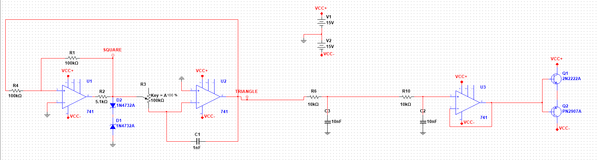

# Analog Function Generator

A fully analog function generator built using discrete op-amp ICs and passive components, capable of producing square, triangle, and approximate sine waveforms across a tunable frequency range. Designed and simulated in NI Multisim, with a working hardware build.

## Waveforms & Specifications

| Parameter | Value |
|---|---|
| Waveforms | Square, Triangle, Sine (RC-approximated) |
| Frequency Range | ~1.87 kHz – 6.41 kHz |
| Frequency Control | 100kΩ potentiometer |
| Supply Voltage | ±15V |

## Circuit Architecture

The circuit is built as four cascaded stages:

### Stage 1 — Square Wave Oscillator
LM741 configured as a Schmitt trigger with positive feedback. Output amplitude is clamped by back-to-back 1N4732A Zener diodes (4.7V) to produce a stable, rail-independent square wave.

### Stage 2 — Triangle Wave Generator
LM741 inverting integrator (R = 100kΩ pot, C = 1nF) integrates the square wave into a triangle wave. Sweeping the potentiometer tunes the output frequency between 1.87 kHz and 6.41 kHz.

### Stage 3 — Sine Wave Shaper
Two cascaded RC low-pass filters (10kΩ / 10nF each, fc ≈ 1.59 kHz) attenuate the harmonics of the triangle wave to approximate a sine wave. The second stage gives –40 dB/decade rolloff, significantly reducing 3rd and higher harmonics. A third LM741 buffers and restores signal amplitude after filter attenuation.

### Stage 4 — Push-Pull Output Buffer
2N2222A (NPN) and PN2907A (PNP) in a Class B push-pull configuration provide current drive capability at the final output.

## Schematic

## Simulation

Simulated in **NI Multisim**. Open `simulation/function_generator.ms14` to explore.

Simulation results:
- Clean square, triangle, and approximate sine waveforms confirmed
- Frequency range of **1.87 kHz – 6.41 kHz** verified via voltage probe sweep across the timing potentiometer

## Components

| Component | Value / Part | Quantity |
|---|---|---|
| Op-Amp | LM741 | 3 |
| NPN Transistor | 2N2222A | 1 |
| PNP Transistor | PN2907A | 1 |
| Zener Diode | 1N4732A (4.7V) | 2 |
| Resistor | 100kΩ | 2 |
| Resistor | 10kΩ | 2 |
| Resistor | 5.1kΩ | 1 |
| Capacitor | 1nF | 1 |
| Capacitor | 10nF | 2 |
| Potentiometer | 100kΩ | 1 |

## Notes

- Sine wave is RC-approximated, not a pure Wien bridge or phase-shift sine oscillator
- Hardware build completed with minor last-minute adjustments from the simulated design
- Hardware photos to be added
